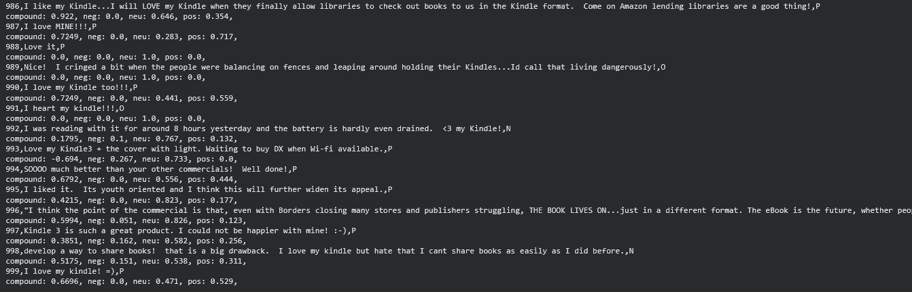

# Text Analysis with NLTK: Tokenization, Stemming, Lemmatization, POS Tagging, Sentiment

A classic NLP processing sweep over a text file using NLTK — sentence/word tokenization, stemming, lemmatization, part-of-speech tagging, and line-by-line sentiment scoring with VADER.

## What it does

1. Downloads the NLTK resources needed (`punkt_tab`, `wordnet`, `averaged_perceptron_tagger_eng`, `vader_lexicon`).
2. Reads the source file as raw text.
3. Tokenizes the text into sentences (using a `PunktSentenceTokenizer` trained on the text itself) and into individual words.
4. Prints each word alongside its **Porter stem** and its **WordNet lemma**.
5. Runs **part-of-speech tagging** on the tokenized text.
6. Re-reads the file line by line and runs **VADER sentiment analysis** on each line, printing the positive/negative/neutral/compound scores.

## Concepts covered

- **Sentence vs. word tokenization** — splitting raw text into sentences and into individual words are different problems (e.g. periods in abbreviations shouldn't end a sentence); NLTK's Punkt tokenizer handles sentence boundaries using a trained/statistical model rather than naive splitting on `.`.
- **Stemming vs. lemmatization** — both reduce words to a base form, but differently: stemming (Porter stemmer) chops word endings using fixed rules and can produce non-words (e.g. "studies" → "studi"), while lemmatization (WordNet) looks up the dictionary base form and produces real words (e.g. "studies" → "study"). Comparing both on the same tokens shows the difference directly.
- **Part-of-speech (POS) tagging** — labels each word with its grammatical role (noun, verb, adjective, etc.), which many downstream NLP tasks depend on for disambiguation (e.g. "run" as a verb vs. a noun).
- **VADER sentiment analysis** — a lexicon- and rule-based sentiment tool tuned specifically for short, informal text (social media posts, in this case), returning separate positive/negative/neutral proportions plus a single normalized `compound` score.

## Project structure

```
main.py      # full pipeline, organized into functions (config, resource setup,
              # tokenization, stemming, lemmatization, POS tagging, sentiment)
README.md    # this file
```

The code is organized into small, named functions driven by a `PipelineConfig` dataclass — `download_nltk_resources`, `load_text`, `tokenize_sentences`, `tokenize_words`, `stem_words`, `lemmatize_words`, `pos_tag_tokens`, `analyze_line_sentiment` — tied together by `run_pipeline()`.

## Requirements

```
nltk
```

Install with:

```bash
pip install nltk
```

NLTK resource downloads happen automatically the first time `run_pipeline()` runs.

## How to run

Place your source file (e.g. `fb_sentiment.csv`, plain text — one entry per line) in the same directory as `main.py`, then:

```bash
python main.py
```

## Sample output

Running the script prints sentence/word tokens, stem/lemma pairs for every token, POS tags, and per-line sentiment scores to the console.


## References

- [GeeksforGeeks — Machine Learning Projects](https://www.geeksforgeeks.org/machine-learning/machine-learning-projects/) — used as a general reference/inspiration while working on this project.


---
*This is a personal learning project, not a production NLP pipeline.*
